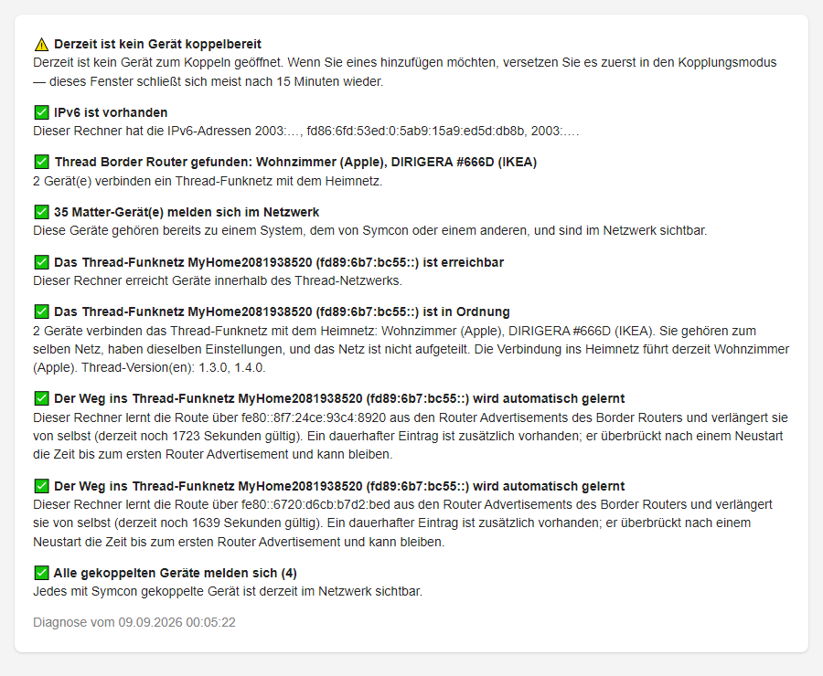

# Matter Diagnose

[](https://github.com/bumaas/MatterDiagnose/actions/workflows/check.yml)

Ein Symcon-Modul, das mit einem Klick prüft, warum Matter-Geräte nicht ins Haus
kommen oder plötzlich verstummen — besonders bei **Matter over Thread**. Das
Ergebnis ist eine Ampel-Liste in Klartext: Was ist los, was bedeutet es, und was
ist zu tun. Ausgeführt wird dabei nichts; das Modul liest nur.



## Wann brauche ich das?

**Die Kopplung endet mit „Fehlgeschlagen" — ohne weitere Angabe.**
Meist scheitert sie in der letzten Phase: Der Symcon-Rechner findet den Weg ins
Thread-Funknetz nicht, hat kein IPv6, oder das Gerät ist schon mit so vielen
Systemen verbunden, dass kein Platz mehr ist. Die Diagnose nennt den Grund und,
wo nötig, den Befehl, der ihn behebt.

**Ein Gerät steht auf „aktiv", liefert aber keine Werte mehr — in der
Hersteller-App oder in Home Assistant läuft es weiter.**
Symcon zeigt den Verlust der Verbindung nicht an der Instanz an: Der Status
bleibt grün, der letzte Wert bleibt stehen. Die Diagnose vergleicht die in Symcon
gekoppelten Geräte mit denen, die sich im Netz tatsächlich melden, und sagt,
welches fehlt.

**Nach einem Neustart oder Update sind Thread-Geräte tot.**
Dann fehlt oft die Route ins Thread-Netz oder der Border Router hat eine neue
Adresse. Die Diagnose sieht beides.

## Installation und erster Lauf

1. Modul installieren — über den Module Store (Beta-Kanal) oder in der
   Modulverwaltung mit `https://github.com/bumaas/MatterDiagnose.git`.
2. Eine Instanz **Matter Diagnose** anlegen (Instanz hinzufügen → Kern-Instanzen).
3. Im Konfigurationsformular **Diagnose starten** klicken. Ein Lauf dauert bis zu
   25 Sekunden; solange steht der Fortschritt im Formular.

Der Bericht erscheint als Liste im Formular und zusätzlich als HTML in der
Variablen **Letzter Bericht**, die sich in jede Visualisierung einbinden lässt.

## So lesen Sie den Bericht

Jeder Befund hat eine Ampel:

| Zeichen | Bedeutung |
|---|---|
| ❌ | **Blocker** — so wird keine Kopplung gelingen und kein Gerät zuverlässig laufen. Steht immer ganz oben. |
| ⚠️ | **Hinweis** — funktioniert gerade, wird aber Ärger machen (etwa nach dem nächsten Neustart), oder es fehlt ein Beleg. |
| ✅ | **In Ordnung** — mit dem Detail, das geprüft wurde, damit Sie es nachvollziehen können. |

Unter jedem Befund steht, was er bedeutet, und — wenn etwas zu tun ist — die
Empfehlung. Befehle, die Administratorrechte brauchen (etwa das Setzen einer
Route), führt das Modul **nie selbst aus**; sie stehen gesammelt im Feld
**Auszuführende Befehle** zum Kopieren. Das ist Absicht: Ein Eingriff in die
Routingtabelle ist eine bewusste Entscheidung.

Ein Lauf ohne Blocker heißt nicht, dass alles perfekt ist — lesen Sie die
Hinweise. Ein Lauf mit Blocker heißt nicht, dass alles kaputt ist: Erst den
Blocker beheben, dann erneut prüfen, oft erledigen sich die Hinweise mit.

## Dauerbetrieb: Wächter und Benachrichtigung

Im Formular steht ein **Prüfintervall in Minuten** (Vorgabe 60, 0 = aus). Mit
eingeschaltetem Wächter wiederholt sich die Prüfung im Hintergrund und schreibt
das Ergebnis in Statusvariablen. Angepingt wird dabei nicht, schlafende
Batteriegeräte bleiben in Ruhe.

> Instanzen, die vor Version 0.4 angelegt wurden, zeigen hier 0 — der Wächter
> ist dann aus, bis Sie einen Wert eintragen.

| Variable | Bedeutung |
|---|---|
| Matter-Netz OK | falsch, sobald ein Befund als Blocker gilt |
| Gekoppelte Geräte / Geräte, die sich annoncieren | Soll- und Ist-Zahl |
| Thread Border Router | Anzahl der gefundenen Border Router |
| Letzte Prüfung | Zeitpunkt des letzten Laufs |
| Letzte Änderungen | Klartext dessen, was sich gegenüber dem Vorlauf geändert hat — **wird nur bei einer echten Änderung beschrieben** |
| Letzter Bericht | vollständiger Bericht als HTML |

**Benachrichtigung in drei Schritten:** Ein Skript anlegen, darunter ein Ereignis
**„Bei Variablenaktualisierung"** auf die Variable **Letzte Änderungen** der
Diagnose-Instanz, und im Skript die Änderung weiterreichen — so, wie Sie
Meldungen sonst verschicken (Push, E-Mail, Telegram …):

```php
<?php
// 12345 durch die ID der Matter-Diagnose-Instanz ersetzen
$ok        = GetValueBoolean(IPS_GetObjectIDByIdent('Healthy', 12345));
$aenderung = GetValueString(IPS_GetObjectIDByIdent('Changes', 12345));
$text      = ($ok ? 'Matter-Netz in Ordnung. ' : 'Matter-Netz gestört! ') . $aenderung;
// hier die eigene Benachrichtigung einsetzen, z. B.
IPS_LogMessage('Matter Diagnose', $text);
```

Das Ereignis feuert genau dann, wenn ein Gerät verschwindet oder zurückkommt, ein
Border Router wegfällt oder ein Befund neu auftritt beziehungsweise sich erledigt
— keine Stundenmeldungen. Der erste Lauf meldet nichts, er legt nur den
Vergleichsstand an. Fehlt beim Lauf ein bekanntes Gerät, fragt das Modul einmal
nach, bevor es urteilt; ein einzelnes verlorenes Paket löst keinen Fehlalarm aus.

## Die Befunde im Überblick

**Ist mein Symcon-Rechner richtig eingerichtet?**
- IPv6 vorhanden oder nicht (VPN-Adapter wie Tailscale oder WireGuard zählen
  nicht — Matter braucht IPv6 im Heimnetz).
- Kommt Multicast an? Antwortet kein einziger Matter-Dienst, prüft das Modul
  mit einer allgemeinen Anfrage, ob das Netz überhaupt Multicast durchlässt
  (typischer Fall: Docker ohne `--network host`).

**Was ist im Netz zu sehen?**
- Thread Border Router — die Geräte, die das Thread-Funknetz mit dem Heimnetz
  verbinden (Apple TV/HomePod, DIRIGERA, Google Nest, Home Assistant mit
  OpenThread …). Ohne Border Router kein Matter over Thread.
- Matter-Geräte, die sich melden, und ob gerade eines **koppelbereit** ist.
  Geräte, die zwar sichtbar sind, deren Kopplungsfenster aber geschlossen ist,
  werden eigens genannt — wer die Kopplungstaste gedrückt hat und das liest,
  weiß: Das Gerät lebt, nur das Fenster ging nicht auf (meist gehört es schon
  zu einem anderen System).

**Kommen meine gekoppelten Geräte durch?**
- Jedes in Symcon gekoppelte Gerät wird im Netz gesucht. Fehlt eines, sagt der
  Befund, ob es vermutlich schläft oder wirklich weg ist, und ob Symcons
  Abonnement dazu ein Problem meldet.
- Ist die Tabelle der verbundenen Systeme eines Geräts voll (bei den meisten
  Geräten fünf), scheitert jede weitere Kopplung ohne erkennbaren Grund — das
  Modul warnt vorher.

**Stimmt der Weg ins Thread-Funknetz?**
- Ist das Thread-Netz erreichbar? Ein kurzer Ping auf Geräteadressen, mit
  Rücksicht auf schlafende Geräte: Ein Fehlversuch ist „nicht eindeutig", kein
  Ausfall.
- Woher hat der Rechner die Route? Unter Windows meldet das Modul, ob sie
  **automatisch gelernt** wird (dann ist nichts zu tun) oder nur von Hand gesetzt
  und nach dem nächsten Neustart weg wäre — samt Befehl, der sie dauerhaft macht.
- Veraltete Routen nach einem Wechsel des Adressbereichs und Routen auf Border
  Router, die es nicht mehr gibt, werden mit Löschbefehl genannt.

**Ist das Thread-Funknetz gesund?**
- Nur ein Border Router (fällt er aus, ist das ganze Netz weg), zwei getrennte
  Thread-Netze (typisch, wenn Apple und Google jeweils ein eigenes aufgemacht
  haben), ein in Teile zerfallenes Netz oder Border Router mit
  unterschiedlichen Einstellungen.

## Grenzen

- Die Diagnose ist **rein lesend**. Empfohlene Befehle führt sie nicht aus.
- In Docker ohne `--network host` kommt kein Multicast an — das meldet die
  Diagnose als eigenen Befund, beheben kann sie es nicht.
- Über die **Funkqualität** im Thread-Netz sagt sie nichts; dafür wäre die
  Schnittstelle eines eigenen Border Routers nötig, die Apple und Google nicht
  anbieten. Ein Gerät gilt als sichtbar, sobald es sich meldet.
- Der Abgleich der gekoppelten Geräte liest die Konfigurationsformulare der
  Matter-Kernmodule aus. Ändert Symcon deren Aufbau, fällt das Modul auf die
  Zuordnung über die Geräteinstanzen zurück und sagt, dass es die Fabric-ID
  nicht lesen konnte.
- Windows-Ausgaben werden in Deutsch und Englisch verstanden; bei anderen
  Sprachen liest das Modul die Routentabelle positionsweise, was in der Regel
  klappt, aber nicht für jede Sprache geprüft ist.

## Begriffe

| Begriff | Bedeutung |
|---|---|
| **Fabric** | Ein Matter-System mit seinen Geräten — Symcon ist eines, die Apple-Home-Welt ein anderes. Ein Gerät kann zu mehreren gehören, aber nur zu einer begrenzten Zahl. |
| **Kopplungsfenster** | Der Zeitraum (meist 15 Minuten), in dem ein Gerät neue Systeme annimmt. Wird per Taste oder App geöffnet. |
| **Border Router** | Das Gerät, das Thread-Funk mit dem Heimnetz verbindet. Thread-Geräte sind ohne ihn unerreichbar. |
| **Abonnement** | Symcons stehende Verbindung zu einem Gerät, über die Werte hereinkommen. Geht sie verloren, bleibt die Instanz trotzdem „aktiv". |
| **Route** | Der Eintrag, der dem Rechner sagt, dass die Adressen des Thread-Netzes über den Border Router zu erreichen sind. |

---

## Anhang für Neugierige

### Wie die Prüfung arbeitet

Das Modul fragt per mDNS/DNS-SD nach drei Diensten: `_meshcop._udp` (Border
Router), `_matter._tcp` (eingebundene Geräte) und `_matterc._udp`
(koppelbereite Geräte). Fehlende Einzelheiten — Hostnamen, IPv6-Adressen, die
TXT-Angaben zum Kopplungsmodus — fragt es in bis zu drei weiteren Runden nach,
Border Router zuerst; einmal gestellte Fragen wiederholt es nicht. Das
Gesamtbudget eines Laufs liegt bei 24 Sekunden, der Erreichbarkeitstest bekommt
den Rest. Die Kopplungsbereitschaft steht im TXT-Schlüssel `CM` (0 = Fenster
zu, 1/2 = offen) — manche Geräte annoncieren nach dem Boot minutenlang mit
`CM=0`, das ist kein Kopplungsfenster.

Die eigene Fabric erkennt das Modul an den Konfigurationsformularen der
Matter-Kernmodule (Fabric-ID des Controllers, Node-IDs der Geräte) und sucht
die passenden `<FabricID>-<NodeID>`-Annoncen im Netz.

### Thread-Details

Die Border Router verraten in ihren `_meshcop`-TXT-Records mehr, als für die
Kopplung nötig ist: `xp` (Extended PAN ID) und `nn` (Netzname) identifizieren
das Thread-Netz, `pt` die Partition, `at` den aktiven Datensatz, `sb` die
Backbone-Router-Rolle, `tv` die Thread-Version. Daraus ergeben sich die Befunde
zur Netzgesundheit. Hersteller kodieren die Partition-ID in unterschiedlicher
Byte-Reihenfolge; der Vergleich toleriert das.

### Windows und die Thread-Route

Der Border Router verteilt die Route ins Thread-Netz per Router Advertisement
(Route Information Option). Windows übernimmt sie, sofern der Heimrouter fremde
Präfixe zulässt (FRITZ!Box: „Auch IPv6-Präfixe zulassen, die andere IPv6-Router
im Heimnetz bekanntgeben", wirksam nach einem Neustart der Box). In der
Routentabelle sehen solche Routen wie von Hand gesetzte aus; nur ihre
Gültigkeitsdauer (`netsh interface ipv6 show route level=verbose`) verrät sie:
endlich und laufend erneuert bei gelernten, „Unendlich" bei manuellen. Das Modul
liest genau das und meldet gelernte Routen als in Ordnung — ein zusätzlich
vorhandener dauerhafter Eintrag gilt als Reserve für die Zeit nach einem
Neustart. Lernt Windows die Route nicht, hilft der vorgeschlagene Befehl mit
`store=persistent`; ohne den Zusatz wäre sie nach dem nächsten Neustart weg.
Unter Linux erneuert das Router Advertisement die Route selbst.

### Nicht geprüft, und warum

Die eigene Controller-Annonce und die Belegung von UDP-Port 5353 (nach
Rücksprache mit Symcon): Symcon ist als Matter-Controller reiner Konsument und
annonciert sich nicht; den mDNS-Port hält Bonjour (Windows) beziehungsweise
Avahi (Linux), ohne die Symcon gar nicht startet. Ebenso nicht: die Zahl fremder
Matter-Systeme im Netz — daraus folgt keine Handlung.

### Tests

```
php tests/run_tests.php
php tests/check_locale.php
```

Die Unit-Tests laufen ohne Symcon: mDNS-Parser, Routenbewertung und
Befund-Logik werden mit echten Paketmitschnitten, echten Systemausgaben und
Szenario-Fixtures geprüft (`tests/fixtures/`). `tests/capture_fixtures.php`
sammelt bei Bedarf frische Mitschnitte aus dem eigenen LAN ein.
